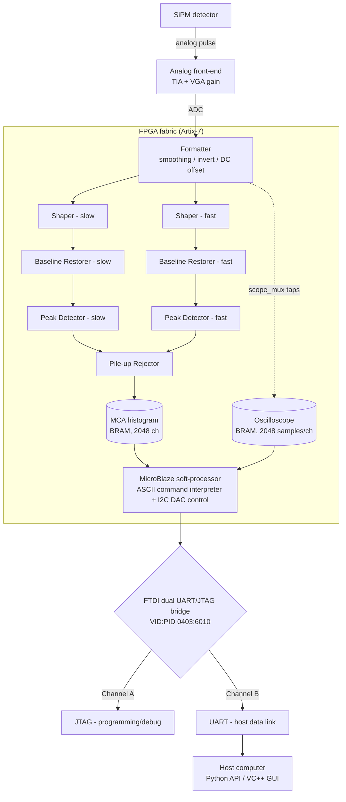
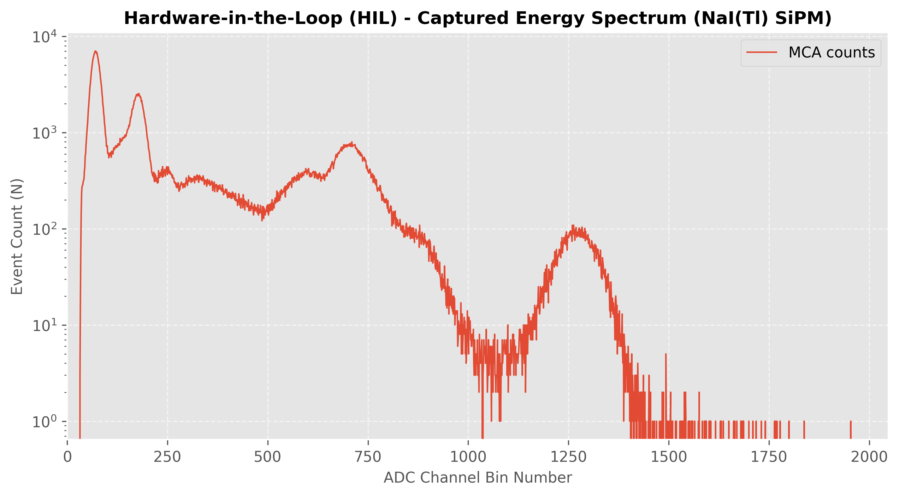
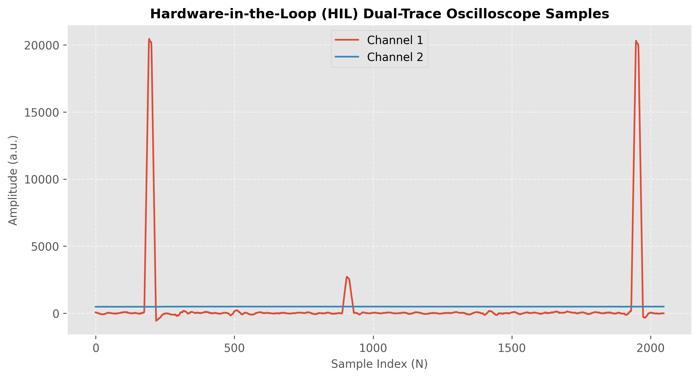

# NSIL-MCA-DPP4SiPM

Digital Pulse Processing (DPP) Multi-Channel Analyzer (MCA) for SiPM-based
radiation detectors, developed by the Nuclear Science and Instrumentation Laboratory (NSIL) at the International Atomic Energy Agency (IAEA). The system performs real-time
pulse shaping, baseline restoration, pile-up rejection, and peak detection
in FPGA fabric, and exposes the resulting spectrum, oscilloscope traces, and
timers to a host computer over a serial (UART) link.

The hardware is built around a Digilent Cmod A7-35T board (AMD/Xilinx
Artix-7 FPGA) with an embedded MicroBlaze soft-processor.

## System architecture

The diagram below traces a signal from the detector to the host application:
the analog pulse is conditioned and digitized, shaped and analyzed in real
time by the FPGA's DPP chain, then handed to the MicroBlaze firmware, which
communicates with the host over the board's USB/serial link.



- **Analog front-end**: a transimpedance amplifier and variable-gain amplifier (`vga_gain_coarse`/`vga_gain_fine`) condition the incoming pulse before digitization. The API also exposes the `high_voltage` (bias) parameter, deprecated carry-overs from the board's PMT-based predecessor design and not available/useful on this SiPM MCA.
- **DPP chain** (FPGA fabric — [`fpga/ip`](fpga/ip), [`fpga/if`](fpga/if)): the first stage is the formatter, which preprocesses the raw 14-bit ADC samples digitally — moving-average smoothing (`smoothing_factor`), polarity inversion (`invert_pulse`), and DC-offset removal (`dc_offset`) — before the signal enters the shaper, baseline restorer, peak detector, and pile-up rejector IP cores, each independently tunable for the slow (energy) and fast (timing) channels — see [Configurable DPP parameters](#configurable-dpp-parameters). Results land in two BRAM sinks: the 2048-channel MCA histogram and a dual-channel oscilloscope capture buffer, the latter mux-selectable to any tap point in the chain for a future development based on ping-pong memory addressing. By default, the cummulative spectrum is recorded in the first BRAM address.
- **MicroBlaze firmware** ([`fpga/ublaze_sw`](fpga/ublaze_sw)): a soft-processor embedded in the same FPGA fabric runs the command interpreter — it parses ASCII commands from the host, reads/writes DPP registers, drives the VGA gain DAC over I2C, and streams histogram (spectrum), scope, and timers data back over UART.
- **Host link**: the board exposes two USB channels through a single FTDI dual-UART chip (VID `0403`, PID `6010`) — one for JTAG programming/debug, one for the host data link. Both channels share the same VID/PID, so host software distinguishes them by the FTDI channel's USB serial-number suffix instead (JTAG ends in `A`, UART ends in `B` — see `DaqHw._disregard_jtag()` in [`core/daq_hw.py`](sw/python-api/core/daq_hw.py)).
- **Serial protocol**: control commands are short ASCII frames — `$<CMD> <params>\r` (e.g. `$RM 0\r` to read the spectrum) — answered with either a plain ASCII reply or an ASCII sync header (`!R`/`!L`) followed by a fixed-size raw binary payload (32-bit words) for bulk data such as the spectrum or oscilloscope trace. See `DaqCliCommands` in [`core/daq_constants.py`](sw/python-api/core/daq_constants.py) for the full command set, and `DaqCommands._send_ascii_cmd`/`read_spectrum`/`read_oscilloscope` in [`core/daq_commands.py`](sw/python-api/core/daq_commands.py) for the framing implementation.
- **Host software**: the [Python API](sw/python-api/) and the [VC++ GUI](sw/vcpp-gui/) are two independent client implementations of this same wire protocol.

## Repository structure

- **[`fpga/`](fpga/)** — FPGA gateware (Vivado block design, IP cores, constraints) and the MicroBlaze embedded firmware (Vitis). See [`fpga/README.md`](fpga/README.md) for how to recreate the hardware project from sources.
- **`sw/`** — Host-side software to control the board and acquire data:
  - **[`sw/python-api/`](sw/python-api/)** — Multiplatform Python API (Linux/Windows/macOS) for control and data acquisition over the serial link.
  - **[`sw/vcpp-gui/`](sw/vcpp-gui/)** — Windows-only graphical interface (Visual C++), compatible with both Ethernet and serial port.
- **`docs/`** — Reference documentation:
  - **[`docs/fpga/`](docs/fpga/)** — DPP parameters and command line for serial protocol reference (PDF).
  - **[`docs/sw/python-api/`](docs/sw/python-api/)** — Python API reference, generated from docstrings (kept in sync with `main` by CI; see [`.github/workflows/python-api-docs.yml`](.github/workflows/python-api-docs.yml)). A combined PDF export is attached to each [release](https://github.com/imoralesgt/NSIL-MCA-DPP4SiPM/releases).

## Python API

The API uses [`uv`](https://docs.astral.sh/uv/) as its package manager: all
dependencies and the required Python version are declared in
[`sw/python-api/pyproject.toml`](sw/python-api/pyproject.toml) and pinned in
`uv.lock`, so `uv` alone is enough to reproduce the environment — no manual
virtualenv or `pip install` step needed.

```bash
cd sw/python-api
uv sync
uv run python main.py
```

The entry point of the API is the `DaqCommands` class in
[`core/daq_commands.py`](sw/python-api/core/daq_commands.py). It is the
high-level interface any application should build on: instantiating it opens a
persistent connection to the board (auto-discovered over USB/serial on
Linux, Windows, and macOS via its FTDI chip's VID/PID, so no manual port
configuration is required in the common case) and exposes the methods to
control acquisition, read back spectra/oscilloscope traces, and configure
timers and DPP parameters.

[`main.py`](sw/python-api/main.py) is not the API itself — it's an example
application built on top of `DaqCommands` (running an acquisition, plotting
the resulting spectrum, exporting it as an ORTEC `.Spe` file). Treat it as a
starting point: import `DaqCommands` from `core.daq_commands` as `main.py`
does, and build your own application's acquisition logic around it. See the
[API reference](docs/sw/python-api/README.md) for the complete method list.

## Configurable DPP parameters

The board's Digital Pulse Processing chain is fully reconfigurable per
acquisition through keyword arguments passed to `DaqCommands` (see
[`core/dpp_parameters.py`](sw/python-api/core/dpp_parameters.py) for the
underlying float-to-fixed-point conversion, and `main.py`'s docstring for
the full list with defaults). Values can also be read back at runtime with
`get_dpp_params(submodule)` and re-uploaded with
`set_dpp_params(submodule, parameters)`. 

For the hardware-level definition
of each parameter and register, see
[`docs/fpga/DPP_parameters.pdf`](docs/fpga/DPP_parameters.pdf).

| Submodule | Key parameters | Purpose |
| --- | --- | --- |
| Formatter | `smoothing_factor`, `invert_pulse`, `dc_offset` | First stage of the DPP chain: digitally preprocesses the raw ADC samples with moving-average smoothing, polarity inversion, and DC-offset removal before shaping. |
| Pulse shaper (slow `shaper_s_*` / fast `shaper_f_*`) | peaking time (`tau_pk`), flat-top time (`tau_pk_top`), gain | Trapezoidal shaping of the raw detector pulse — the slow channel for energy measurement, the fast channel for timing/triggering. A `poles` parameter also exists to compensate the long decay tail on PMT-based implementations, but is deprecated and not useful for this SiPM MCA (default 2). |
| Baseline restorer (BLR, slow `blr_s_*` / fast `blr_f_*`) | high/low threshold (V), threshold gain, `enable` | Dynamically corrects baseline drift ahead of shaping, independently tunable per channel. |
| Peak detector (`pkd_*`) | blanking time factor, time-over-threshold factor, `x_min`/`x_max` (LLD/ULD, in V), per slow/fast channel | Detects the shaped pulse's peak for histogramming and applies lower/upper level discrimination. |
| Pile-up rejector (`pur_*`) | guard time factor, `enable` | Rejects overlapping pulses so the spectrum isn't distorted by pulse pile-up. |
| Oscilloscope (`scope_*`) | buffer size, trigger threshold/delay, downsample factor, `scope_mux_ch1`/`ch2` | Captures raw dual-channel debug waveforms; the mux selects which two points in the processing chain are routed to the two scope channels. |
| Timers (`timers_*`) | preset (ms), auto mode, live-time vs. real-time mode, enable/clear, per channel (A/B/C) | Tracks acquisition run time — dead-time-corrected (live time) or wall-clock (real time), independently per timer channel. |
| Analog front-end | `vga_gain_coarse`/`vga_gain_fine` | Pre-ADC gain conditioning via the VGA DAC. A `high_voltage` bias parameter also exists, but like `poles`, it's a deprecated carry-over from the board's PMT-based predecessor design and is not available on this SiPM MCA. |

## Captured data

Example output from the Python API's HIL test suite
([`sw/python-api/tests/test_hil_daq.py`](sw/python-api/tests/test_hil_daq.py)),
acquired from a NaI(Tl) scintillator coupled to the SiPM:

| Spectrum acquisition | Oscilloscope trace |
| --- | --- |
|  |  |

- **Spectrum** (left): the 2048-channel energy histogram returned by
  `read_spectrum()` — event count per ADC bin, log scale. This is the same
  data `main.py` exports as an ORTEC `.Spe` file (see the committed
  `sw/python-api/SYS*_CALIB.spe` calibration runs).
- **Oscilloscope** (right): the dual-channel debug waveform returned by
  `read_oscilloscope()` — 2048 raw samples per channel, tapped from the
  points in the shaping chain selected by `scope_mux_ch1`/`scope_mux_ch2`,
  useful for visually verifying shaping/BLR/peak-detection behavior.

## License

BSD 2-Clause License. See [`LICENSE`](LICENSE).
